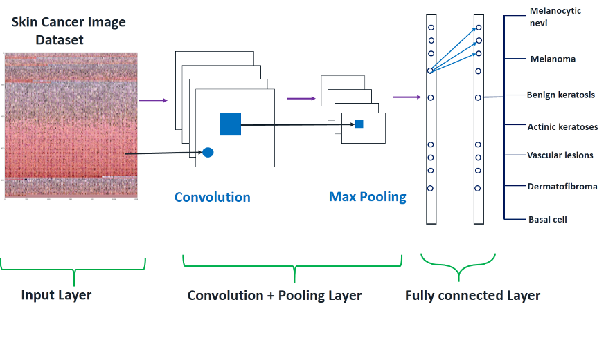

# 🩺 Skin Cancer Detection

### Deep Learning • Computer Vision • Flask

<p>
  <b>AI-powered skin lesion classification using a custom CNN model</b>
</p>

<p>
  
  
  
  
  
</p>

<p>
  <a href="https://github.com/YOUR_USERNAME/Skin_Cancer_Detection_using_deep-learning">
    
  </a>
  <a href="https://skincareaware.blogspot.com/2024/10/skin-cancer-detection-using-machine.html">
    
  </a>
</p>

</div>

---

## 🔬 Overview

**Skin Cancer Detection** is a deep learning-based computer vision project
that classifies skin lesion images into **7 different categories** using a
custom **Convolutional Neural Network (CNN)**.

The trained model is integrated with a **Flask web application**, allowing
users to upload an image and receive a predicted class through a simple
web interface.

> **Image → Preprocessing → CNN → Classification → Result**

---

## ✨ Features

| | Feature | Description |
|---|---|---|
| 🧠 | **Custom CNN** | Deep learning model for skin lesion classification |
| 🔬 | **7-Class Prediction** | Supports seven different lesion categories |
| 📷 | **Image Upload** | Upload skin images through the web interface |
| 👁️ | **Image Preview** | Preview the selected image before prediction |
| ⚡ | **Real-Time Inference** | Generate predictions through the Flask backend |
| 🌐 | **Web Interface** | Simple browser-based prediction system |
| 📊 | **Softmax Output** | Produces probability scores for each class |
| 📓 | **Jupyter Notebook** | Model experimentation and development |

---

## 🧬 Supported Classes

The model is configured to classify the following **7 categories**:

| # | Skin Lesion Category |
|:---:|---|
| 01 | Actinic Keratoses & Intraepithelial Carcinomae |
| 02 | Basal Cell Carcinoma |
| 03 | Benign Keratosis-like Lesions |
| 04 | Dermatofibroma |
| 05 | Melanocytic Nevi |
| 06 | Pyogenic Granulomas & Hemorrhage |
| 07 | Melanoma |

---

## 🏗️ Model Architecture

The project uses a custom **TensorFlow/Keras CNN** with convolution,
pooling, batch normalization, dropout and dense layers.

<div align="center">



</div>

### Architecture Flow

```text
                    INPUT
                 28 × 28 × 3
                      │
                      ▼
              ┌───────────────┐
              │ Conv2D (16)    │
              └───────┬───────┘
                      ▼
                Max Pooling
                      │
              Batch Normalization
                      │
                      ▼
              Conv2D (32 → 64)
                      │
                Max Pooling
                      │
              Batch Normalization
                      │
                      ▼
             Conv2D (128 → 256)
                      │
                      ▼
                   Flatten
                      │
                   Dropout
                      │
                Dense Layers
                      │
              Batch Normalization
                      │
                   Dropout
                      │
                      ▼
                  Softmax
                      │
                      ▼
                7-Class Output

```

